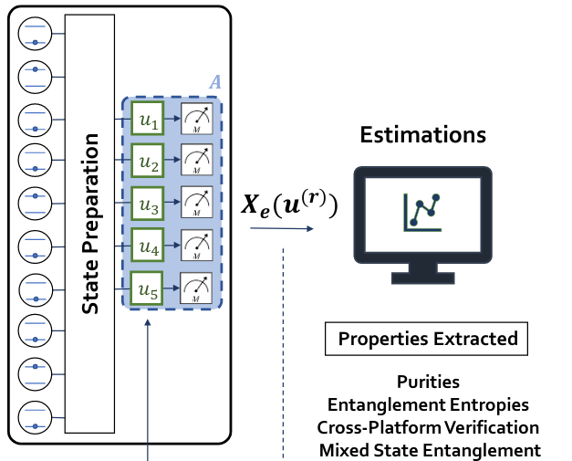

# RandomMeas.jl: Julia Interface to (common) randomized measurements

We provide scripts to estimate expectation values of single-copy and multi-copy observables with randomized measurements . 
The library uses ITensors.jl to postprocess randomized measurements data.

## von Neumann entropy from common randomized measurements
Polynomial approximation of the von Neumann entropy are obtained via (common) randomized measurements. In order to reduce statistical errors, we incorporate approximate prior knowledge in the the form of a pseudo-state \sigma of the quantum state of interest \rho using common randomized measurements. 

+ [Original Paper](http://arxiv:)
+ [Script](vonNeumann.jl)

## Fidelities from common randomized measurements
The fidelity is obtained from common randomized measurements. We use as priors multiple Matrix-Product-States of varying bond dimensions. This example uses the library PastaQ.jl to represent quantum states generated by random quantum circuits.

+ [Original Paper](http://arxiv:)
+ [Script](Fidelity.jl)

License: Apache 2.0 http://www.apache.org/licenses/LICENSE-2.0

First version: April 2023
