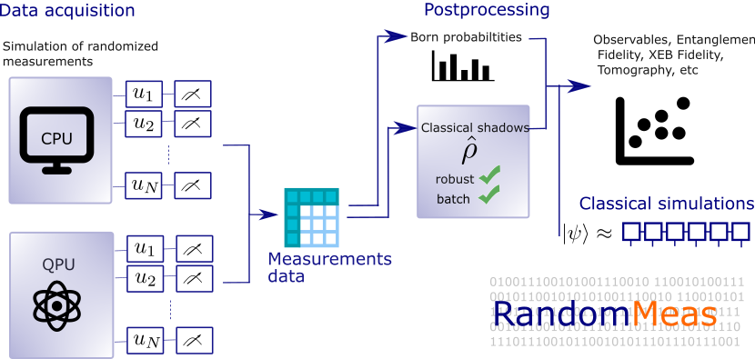

# RandomMeas: The randomized measurements toolbox in julia

[](https://bvermersch.github.io/RandomMeas.jl/dev/)
[](https://github.com/bvermersch/RandomMeas.jl/actions/workflows/CI.yml?query=branch%3Amain)
[](https://opensource.org/licenses/Apache-2.0)

This package presents efficient routines for testing and postprocessing randomized measurements, in order to estimate physical properties in quantum computers.

RandomMeas relies heavily on ITensors. Some examples use the packages PastaQ and MAT

.

## Install

In a Julia terminal, install the package RandomMeas

```julia
julia> ]
pkg> add RandomMeas
```

## Documentation

[dev](https://bvermersch.github.io/RandomMeas.jl/dev/) -- documentation of the in-development version.

## Presentation

1) Routines to prepare on QPUs/simulate the data acquisition

 ```julia
 using ITensors,ITensorMPS
 using RandomMeas
 N  = 2
 ψ = random_mps(siteinds("Qubit", 2*N); linkdims=2^N);
 ρ,ξ = reduce_dm(ψ,1,N)
 

 nu=100 #number of random unitaries
 NM=100 #number of projective measurements
 data = zeros(Int8,(nu,NM,N))
 for r in 1:nu
     #generate Haar-random single qubit rotations
     u = get_rotations(ξ,"Haar")
     #acquire RM measurements
     data[r,:,:] = get_RandomMeas(ρ,u,NM,"dense")
 end
 ```

2) Postprocessing routines for randomized measurements, eg to get the purity

 ```julia
 purity_e = get_purity_hamming(data,ξ)
    println("estimated purity ", purity_e)
    println("exact purity ", get_purity(ρ))
 ```

3) Interface with matrix-product-states simulations with ITensors.jl to simulate large-scale randomized measurements protocols.

4) Jupyter notebooks to present various recent case studies.

## Examples with Jupyter notebooks

### Classical shadows

1) [Energy/Energy variance measurements with classical shadows](examples/EnergyVarianceMeasurements.ipynb)

2) [Robust Shadow tomography](examples/RobustShadowTomography.ipynb)

3) [Process Shadow tomography](examples/ProcessShadowTomography.ipynb)

4) [Classical shadows with shallow circuits](examples/ShallowShadows.ipynb)

5) [Virtual distillation](examples/VirtualDistillation.ipynb)

### Quantum benchmark

6) [Cross-Entropy/Self-Cross entropy benchmarking](examples/CrossEntropy.ipynb)

7) [Fidelities from common randomized measurements](examples/FidelityCommonRandomizedMeasurements.ipynb)

8) [Cross-Platform verification](examples/CrossPlatform.ipynb)

### Entanglement

9) [Entanglement entropy of pure states"](examples/PureStateEntanglement.ipynb)

10) [Analyzing the experimental data of Brydges et al, Science 2019](examples/BrydgesScience2019.ipynb)

11) [Surface code and the measurement of the topological entanglement entropy](examples/EntanglementSurfaceCode.ipynb)

12) [Mixed-state entanglement: The p3-PPT condition and batch shadows](examples/MixedStateEntanglement.ipynb)

### Miscellanous

13) [Noisy circuit simulations with tensor networks](examples/CircuitNoiseSimulations.ipynb)

14) [Estimating statistical error bars via Jackknife resampling](examples/ErrorBars.ipynb)

15) [Executing randomized measurements on IBM's quantum computers](examples/RandomizedMeasurementsQiskit.ipynb)

16) [Postprocessing randomized measurements from IBM's quantum computers](examples/RandomizedMeasurementsQiskitPostprocessing.ipynb)